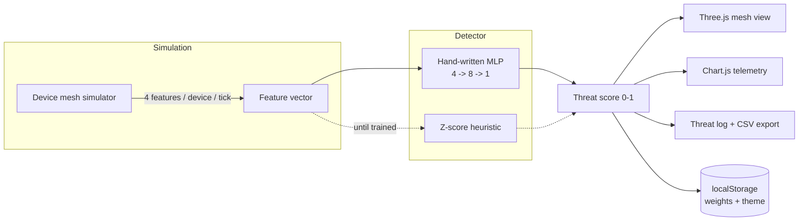

# PulseGrid

[](https://github.com/Nikhil-creat/pulsegrid/actions/workflows/deploy.yml)
[](LICENSE)


**Designed & Developed by**
# NIKHIL CHARY SRIRAMOJU
BTech CSE (Final Year)

- GitHub: [Nikhil-creat](https://github.com/Nikhil-creat)
- LinkedIn: [nikhil-chary-sriramoju](https://in.linkedin.com/in/nikhil-chary-sriramoju-95041b38a)
- Email: sriramojunikhil66@gmail.com
- Instagram: [@nikhil__sriramoju](https://www.instagram.com/nikhil__sriramoju)
- Facebook: [Profile](https://www.facebook.com/profile.php?id=100079201124141)


An IoT device mesh, simulated live in the browser and watched by a small neural network that's trained from scratch, in the browser too — no server, no ML library, rendered as an interactive 3D graph.

**Live:** https://nikhil-creat.github.io/pulsegrid/

---

## Contents

- [What it does](#what-it-does)
- [Architecture](#architecture)
- [Project structure](#project-structure)
- [Running locally](#running-locally)
- [Testing](#testing)
- [Deployment (CI/CD)](#deployment-cicd)
- [Features](#features)
- [Extending it](#extending-it)

## What it does

Ten simulated IoT devices (sensors, locks, cameras, relays) each stream four features every tick — request rate, latency, auth-failure rate, packet jitter — around a per-device baseline. Roughly one tick in twelve, a random device is pushed into an "attack" state that shifts those features well outside baseline; you can also trigger one manually.

A 4 → 8 → 1 feed-forward network scores every device on every tick. Its forward pass, MSE loss, and backpropagation are hand-written in plain JS — no TensorFlow.js, no ML library. Before training it falls back to a z-score heuristic. Pressing **Train** generates 500 labelled synthetic samples, splits them 400/100 train/holdout, and runs 220 epochs of full-batch gradient descent, plotting the loss curve live and reporting holdout accuracy. Trained weights can be saved to `localStorage` and are restored automatically on your next visit.

## Architecture



Everything above runs client-side. There's no API call and no build step, which is what makes the whole thing deployable as a static GitHub Pages site.

## Project structure

```
pulsegrid/
├── index.html                  entry point — markup only
├── assets/
│   ├── css/styles.css          all styling, light/dark theme tokens
│   └── js/
│       ├── mlp.js              dependency-free core: gaussian sampler,
│       │                       MLP, forward pass, backprop, dataset synth
│       │                       (dual Node/browser module — see tests/)
│       └── app.js              simulation, 3D scene, charts, UI wiring,
│                                tick loop — everything DOM-dependent
├── tests/
│   └── mlp.test.js             unit tests for assets/js/mlp.js
├── .github/workflows/
│   └── deploy.yml              CI: run tests, then deploy to Pages on main
├── package.json
├── LICENSE                     MIT
└── README.md
```

The split matters: `mlp.js` has no `window`/`document` dependency, so it loads both as a `<script>` in the browser (attaches to `window.PulseGridMLP`) and as a CommonJS module in Node for testing — same file, two runtimes.

## Running locally

No install needed — just open `index.html` in a browser. To serve it properly (recommended, since some browsers restrict local file access for canvas/fetch):

```bash
npm start
# or: python3 -m http.server 8000
# then visit http://localhost:8000
```

## Testing

The core detector algorithm is unit-tested with Node's built-in test runner — no extra dependencies:

```bash
npm test
```

This covers: weight-shape correctness, that `forward()` stays inside the sigmoid's (0, 1) range, that `trainStep()` actually reduces loss over repeated steps on a fixed example, and — the real check — that a network trained on `synthesizeDataset()` clears 75% holdout accuracy. All 7 tests currently pass.

## Deployment (CI/CD)

`.github/workflows/deploy.yml` runs on every push to `main`: it first runs `npm test`, and only deploys to GitHub Pages if the tests pass. First-time setup:

1. Push this repo to GitHub (see below if you haven't yet).
2. **Settings → Pages → Build and deployment → Source** → choose **GitHub Actions** (not "Deploy from a branch").
3. Push to `main` (or re-run the workflow from the **Actions** tab). The badge at the top of this README reflects the latest run.

### First push, from scratch

```bash
git init
git add .
git commit -m "Initial commit"
git branch -M main
git remote add origin https://github.com/Nikhil-creat/pulsegrid.git
git push -u origin main
```

Then do step 2 above. The first push will trigger the workflow automatically; check the **Actions** tab for progress, and **Settings → Pages** for the live URL once it's done.

## Features

- Boot sequence with an animated startup log
- Simulated 10-device mesh with random and manually-triggered attacks
- Hand-written 4→8→1 MLP with live training, loss curve, holdout accuracy
- Save/restore trained weights via `localStorage`
- 3D mesh view (Three.js) — drag to orbit, click a node for detail
- Per-device detail modal with a live sparkline
- Mesh controls — trigger attacks, adjust simulation speed and attack frequency
- Telemetry chart (Chart.js) + a clickable, exportable (`.csv`) threat log
- Sound alerts via the Web Audio API
- Light/dark theme toggle, persisted
- Terminal-style system console

## Extending it

- Swap `synthesizeDataset()` for a real public IoT intrusion dataset (e.g. N-BaIoT) loaded as static JSON.
- Add a second hidden layer or dropout in `mlp.js` and compare holdout accuracy — the test suite will tell you immediately if it regresses.
- Add a confusion-matrix view next to the loss curve.
- Persist the full threat log (not just weights) to `localStorage`.

---

